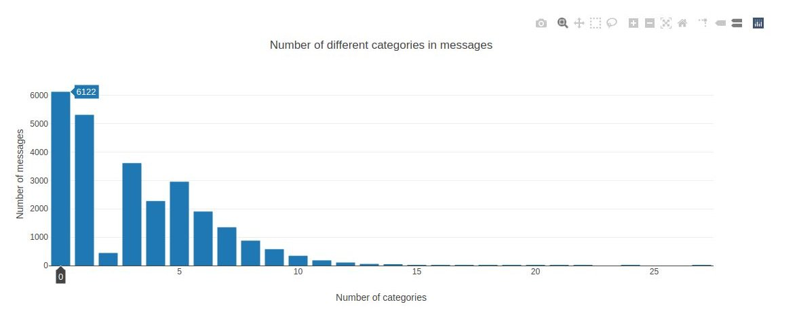

# Disaster response pipeline

Machine learning pipeline to categorize real messages that were sent during disaster events so that you can send the messages to an appropriate disaster relief agency.

## Instructions

1. Run the following commands in the project's root directory to set up database and model:

    - To run ETL pipeline that cleans data and stores in database
    
        `python data/process_data.py data/disaster_messages.csv data/disaster_categories.csv data/DisasterResponse.db`
    - To run ML pipeline that trains classifier and saves it as pickle
    
        `python models/train_classifier.py data/DisasterResponse.db models/classifier.pkl`
    - To generate word cloud image with most relevant words in the training sets
    
        `python helpers/generate_wordcloud.py`

2. Run the following command in the app's directory to run your web app:

    `python run.py`

3. Go to http://0.0.0.0:3001/

## Installations

Project created using:
```
Python 3.6.10
```

Additional packages and versions used:
```
pandas 1.0.3
sqlalchemy 1.3.16
scikit-learn 0.22.1
nltk 3.4.5
plotly 4.6.0
flask 1.1.2
wordcloud 1.7.0
```

## Project Motivation

Project to practice skills acquired in course 4 (Data Engineering) of Udacity Data Scientist Nanodegree Program (ETL, NLP, and machine learning pipelines).

## File Descriptions

```text
disaster-response-pipeline/
├── app/
│   ├── static/
│   │   └── images/
│   │       └── wordcloud.png
│   ├── templates/
│   │   ├── go.html
│   │   └── master.html
│   └── run.py
├── data/
│   ├── disaster_categories.csv
│   ├── disaster_messages.csv
│   ├── DisasterResponse.db
│   └── process_data.py
├── docs/
│   └── images/
│       ├── dataset_overview_1.jpg
│       ├── dataset_overview_2.jpg
│       └── message_classify.jpg
├── helpers/
│       ├── generate_wordcloud.py
│       └── utils.py
└── models/
    ├── classifier.pkl
    └── train_classifier.py
```

#### 1. ETL Pipeline
**data** folder contains 2 data files (*disaster_messages.csv* and *disaster_categories.csv*) and a data cleaning pipeline (*process_data.py*) that:

- Loads the messages and categories datasets
- Merges the two datasets
- Cleans the data
- Stores it in a SQLite database

#### 2. Machine Learning Pipeline
**models** folder contains a Python script (*train_classifier.py*) with a machine learning pipeline that:

- Loads data from the SQLite database
- Splits the dataset into training and test sets
- Builds a text processing and machine learning pipeline
- Trains and tunes a model using GridSearchCV
- Outputs results on the test set
- Exports the final model as a pickle file

#### 3. Flask Web App
**app** folder contains a Flask Web App to:

- Display three visualizations of train data and a word cloud.
- Uses the trained model to input text and return classification results.

**helpers** folder it's for support code. Contains a python script for generating cloud word image and a utils function (tokenize).

**docs** folder it's for support files for this README. It contains a image folder with some screen captures of the App.

## Results

Web App to categorize real messages that were sent during disaster events.

1. Message classification

    

2. Wordcloud of training dataset

    

3. Overview of training dataset 1

    

4. Overview of training dataset 2

    

## Acknowledgements

Disaster data come from [Figure Eight](https://www.figure-eight.com/) (now [appen](https://appen.com/)).

Project idea and guidance comes from [Udacity Data Scientist Nanodegree Program](https://www.udacity.com/course/data-scientist-nanodegree--nd025).
